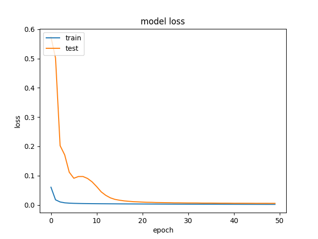

# Autoencoder

Generate a image from human pose

## Pre-requisites
```
python 3.6
tensorflow 2.3
numpy
```

## Data preparation
The preparation stage simply split the dataset into train, validataion, and test sets. Since the train and test sets are came from the same origin, no data agumentation is applied for now. But, to apply the model for other datasets, we should consider to use random crop, horizontal flip, or small rotation. 
Run
```
python preprocess.py
```
to split the dataset into 80/20/20. All paths are configured at `config.py`.

## Train
To train a model, run
```
python train.py
```

## Training results
Note that the `test` label indicates `validation set`, not `test set`.



