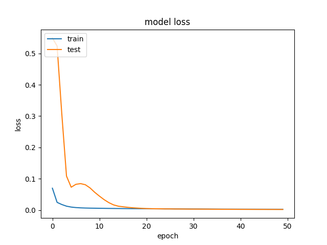
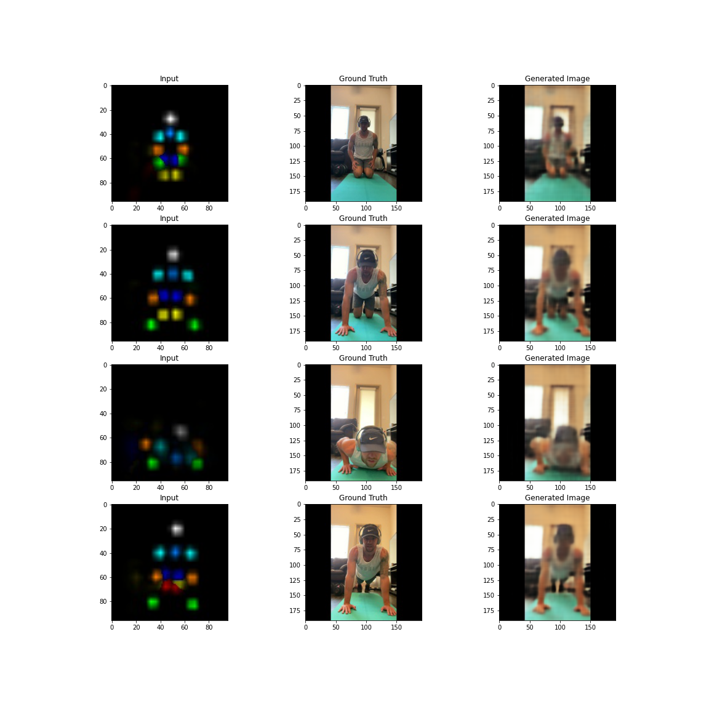

# Autoencoder

Generate images from human pose

## Pre-requisites
```
python 3.6
tensorflow 2.3
numpy
matplotlib
```

## Data preparation
The preparation stage simply splits the dataset into train, validation, and test sets. Since the train and test sets are came from the same origin, no data agumentation is applied for now. But, to generalize the model, we should consider to use random crop, horizontal flip, or small rotation.    
Run
```
python preprocess.py
```
to split the dataset into 80/20/20. All paths are configured at `config.py`.

## Train
To train a model, run
```
python train.py
```
It will store the model at `saved_model`.
## Test
To test the model, run
```
python test.py
```
This will generate images using the test set defined above. As a default, it will process every 4 images (batch size) and store the images at the `imgs` directory.

## Model
The model weights can be downloaded from [Google Drive](https://drive.google.com/file/d/1xuNkqoLDDGjcY7VsxlPWnQA8PIqqc6Qh/view?usp=sharing). Store the model weight at the `saved_model` directory.   
## Metric
The structural similarity index measure (SSIM) index is used to measure the similarity between the target and generated images.    
## Results
The average of SSIM indices at the test set is `0.8366`.
### Training results
Note that the label `test` indicates the `validation` set, not the `test` set.


### Example of inference on the test set



